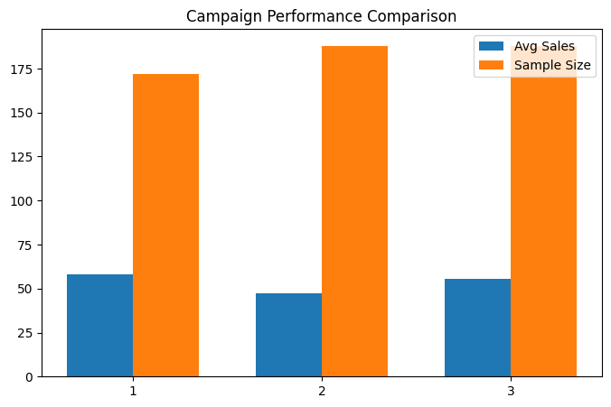

## Project Overview
The aim of this project is to assess the effectiveness of three marketing campaigns of a fast-food chain in promoting a new product. The objective is to evaluate which promotion strategy generates the highest sales performance and provide data-driven recommendations.

The project follows an end-to-end analytical workflow, including data cleaning, SQL-based querying, exploratory data analysis, statistical hypothesis testing, and business insight generation. ANOVA and Tukey’s HSD post-hoc analysis were used to statistically analyse differences among the promotion groups.

----

## Objectives
Evaluate the performance of three promotion strategies
Analyze sales trends across time (4-week period)
Assess impact of market size on campaign effectiveness
Perform statistical testing to validate differences between groups
Provide actionable business recommendations

----

## Tools & Technologies
- Python (Pandas,Matplotlib, SciPy) — data cleaning, statistical analysis, statistical testing, and data visualization
- SQL (SQLite) — data querying and aggregation
- ANOVA & Tukey's HSD Test - statistical validation and post-hoc group comparison

---

## Dataset
- Source: Kaggle (Fast Food Marketing Campaign A/B Test)
- Structure: MarketID, LocationID, Promotion (1, 2, 3), Week (1–4). SalesInThousands, and MarketSize (Small, Medium, Large)

---

## Methodology
1. Data Preparation
- Cleaned dataset using Python (checked for missing values, validated data types)
- Loaded structured data into SQL for querying and aggregation

2. Exploratory Data Analysis (SQL & Python)
- Calculated average sales across promotion groups
- Analyzed weekly sales trends over a four-week period
- Segmented campaign performance by market size
- Visualized campaign performance using Matplotlib charts

3. Statistical Testing
#### A. ANOVA test 
- Conducted a one-way ANOVA test to determine whether there were statistically significant differences in average sales across the 3 promotion groups. 
  
- Result:
     --> F-statistic: 21.95
     --> p-value: 6.77e-10
  
- Interpretation:
The extremely low p-value (p < 0.05) indicates that there are statistically significant differences in average sales between at least one pair of promotion groups.

#### B. Post-hoc Analysis (Tukey’s HSD Test)
- Tukey's HSD test was performed to identify which specific promotion groups differ significantly.
  
- Key Findings:
  --> Promotion 1 performs significantly better than Promotion 2
  --> Promotion 3 performs significantly better than Promotion 2
  --> No statistically significant difference between Promotion 1 and Promotion 3

These findings suggest that Promotion 2 consistently underperformed, while Promotions 1 and 3 achieved comparable sales performance.

---

## Key Insights
#### - Promotion Performance
Promotion 1 achieved the highest average sales (~58K)
Promotion 3 showed moderate performance (~55K)
Promotion 2 significantly underperformed (~47K)

#### - Time Trend (4 Weeks)
Performance ranking remained consistent across all weeks
Promotion 1 consistently outperformed others
Minimal fluctuation → stable campaign effectiveness

#### - Market Size Impact
Large markets: highest sales (~60K–77K)
Small markets: moderate (~50K–60K)
Medium markets: lowest (~39K–47K)

---

## Business Recommendations
- Prioritize Promotion 1 as the primary campaign strategy
- Re-evaluate or redesign Promotion 2 due to consistent underperformance
- Focus marketing efforts on large markets for maximum impact
- Investigate structural issues in medium-sized markets

---

## Conclusion
This analysis demonstrates that marketing strategy selection has a measurable impact on sales performance. The statistical tests showed that Promotion 2 significantly underperformed compared to Promotions 1 and 3, while no significant difference was observed between Promotions 1 and 3.

The project demonstrates the use of SQL, Python, and statistical analysis to transform raw business data into actionable insights and support evidence-based decision-making.

---

## Key Visualizations (Python)

### Campaign Performance

**Objective**
- Compare average sales performance across the three promotion groups.
- Helps identify whether differences in performance may be influenced by sample size distribution.

**Key Insights**
- Promotion 1 achieved the highest average sales.
- Promotion 3 demonstrated comparable performance to Promotion 1.
- Promotion 2 consistently generated lower average sales.
- Sample sizes were relatively balanced across groups, suggesting that performance differences are unlikely to be driven by unequal group representation..
